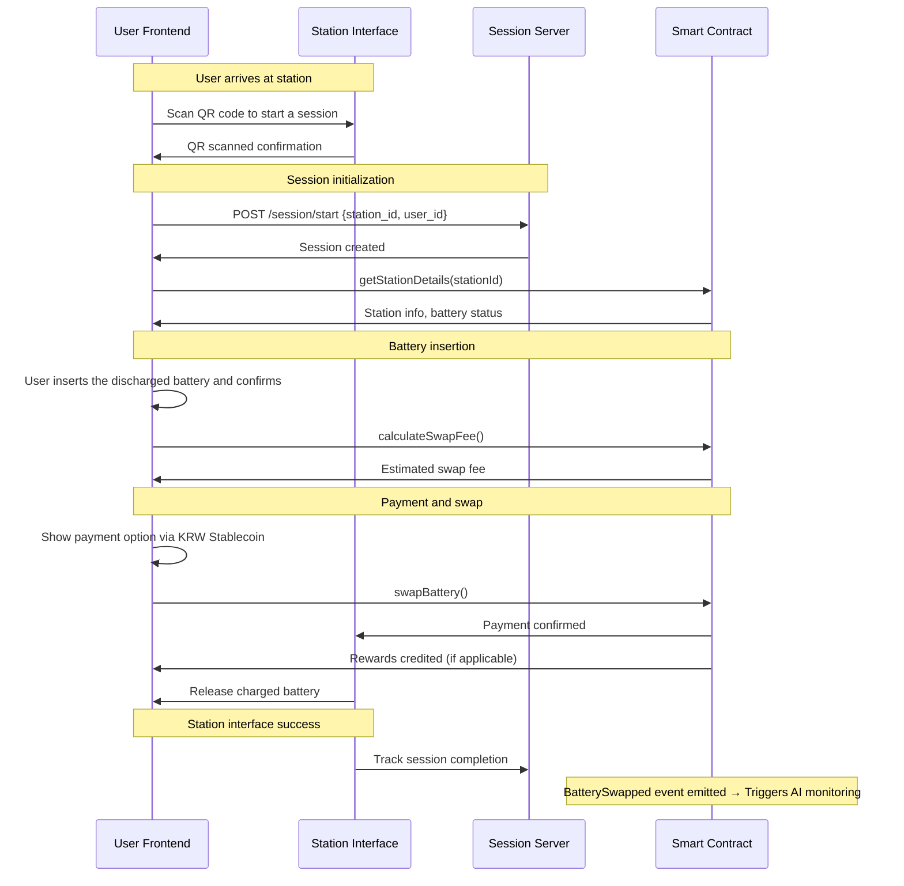
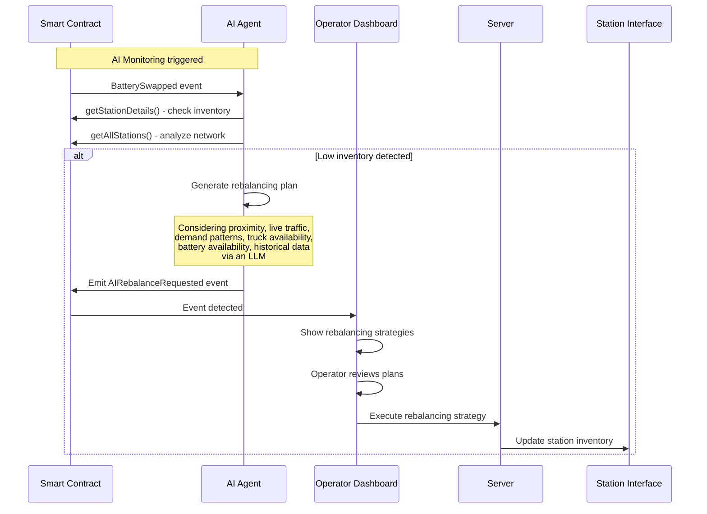

# Vyan — A De-PIN for EV Battery Swapping

**Vyan** is a decentralized battery-swapping network designed for dense urban environments in South Korea. It combines **IoT-enabled swap stations, an on-chain battery registry (De-PIN), and AI-driven inventory rebalancing**.  
All payments and rewards are powered by a **KRW-pegged stablecoin**, making adoption seamless for local users.  

Vyan reduces **range anxiety** and **operating costs** for EV owners and fleet operators by enabling rapid swaps, ensuring renewable energy attribution, and making battery value transparent and auditable on-chain.  

---

## Problem
Despite incentives, EV adoption in Korea faces barriers:
- Charging bottlenecks → Long charging times & costly infrastructure.  
- Battery trust issues → No transparent audit trail for usage/valuation.  
- Inventory imbalance → Uneven distribution of charged batteries across stations.  
- Renewable attribution → Lack of reliable tracking for green charging.  
- Ecosystem silos → Vendor lock-in and poor interoperability.  

---

## Solution
Vyan addresses these challenges with a **decentralized, AI + blockchain–powered approach**:

- **On-chain Identity (De-PIN):** Transparent battery + station metadata stored immutably.  
- **IoT Telemetry:** Stations stream signed data on charging, temperature, and renewable sources.  
- **AI Inventory Agent:** Forecasts demand, optimizes battery rebalancing, and cuts downtime.  
- **KRW Stablecoin:** Seamless payments & programmable rewards for green charging.  
- **User-Friendly Wallets:** Account abstraction for a Web2-like experience.  

---

## System Flow

### 1. User Journey and Battery Swap

### 2. Operator Journey and Battery Rebalancing

## Learn More

- [Vyan Whitepaper](Vyan_Whitepaper.pdf)

## Contributing

Contributions are welcome! Please feel free to submit a pull request.

## Authors

- [Parth Mittal](https://github.com/mittal-parth)
- [Abhiraj Mengade](https://github.com/abhiraj-mengade)