# ⚡️ Vyan — A De-PIN for EV Battery Swapping

- [Whitepaper](https://vyan-energy.vercel.app/Vyan_Whitepaper.pdf)
- [Pitch Deck](https://www.canva.com/design/DAGxPu4Eaqo/VcGGmNVwWiRtqdBv_y-ZtA/view?utm_content=DAGxPu4Eaqo&utm_campaign=designshare&utm_medium=link2&utm_source=uniquelinks&utlId=h64bea47428)
- [Demo Video](https://youtu.be/EAZyaGXbmcM)

## Table of Contents

- [Overview](#overview)
- [Problem](#problem)
- [Solution](#solution)
- [System Flow](#system-flow)
    - [User Journey and Battery Swap](#user-journey-and-battery-swap)
    - [Operator Journey and Battery Rebalancing](#operator-journey-and-battery-rebalancing)
- [Contributing](#contributing)
- [Authors](#authors)

## Overview 📄

**Vyan** is a decentralized battery-swapping network designed for dense urban environments in South Korea. It combines **IoT-enabled swap stations, an on-chain battery registry (De-PIN), and AI-driven inventory rebalancing**.  
All payments and rewards are powered by a **KRW-pegged stablecoin**, making adoption seamless for local users.  

Vyan reduces **range anxiety** and **operating costs** for EV owners and fleet operators by enabling rapid swaps, ensuring renewable energy attribution, and making battery value transparent and auditable on-chain.  

---

## Problem 🤔

- **Battery provenance and valuation**:  
  The value of a battery is highly dependent on its usage history—including age, charge/discharge cycles, and thermal stress.  
  Without reliable audit trails, users and operators face uncertainty in pricing and valuation, leading to inefficiency and mistrust.

- **Centrally controllable pricing**:  
  Fleet operators have central control over pricing of swaps and can dictate the pricing without the user knowing about it.

- **Inventory and rebalancing**:  
  Swap stations require a reliable supply of fully charged batteries, but demand fluctuates across locations and times.  
  Managing inventory and rebalancing stock between stations is logistically complex and cost-intensive.

- **Renewable attribution**:  
  EVs are only environmentally sustainable if the electricity used for charging is itself renewable.  
  Tracking and verifying renewable energy usage requires trusted data sources, reliable meter attestations, and careful oracle design.

- **Ecosystem coordination**:  
  A scalable battery swapping network requires cooperation between hardware manufacturers, software providers, and operators.  
  Existing systems are often siloed, with vendor lock-in and lack of interoperability slowing ecosystem growth.

---

## Solution 💡

Vyan proposes a decentralized EV battery swapping ecosystem that integrates **blockchain, IoT, and AI** to address these challenges.  
By combining these technologies, Vyan ensures transparency, efficiency, and scalability in a way that centralized solutions cannot.

- **On-chain battery and station identity (De-PIN)**:  
  Each battery and station is assigned a cryptographic identity, with metadata such as battery age, cycle count, and provenance stored immutably on-chain.  
  This ensures transparency, prevents tampering, and enables fair valuation during swaps.

- **IoT-enabled stations with signed telemetry**:  
  Stations are equipped with IoT modules that capture and sign real-time data on charging events, temperature, and energy source attribution.  
  This data is transmitted securely to the blockchain, building trust in the accuracy of operational information.

- **AI inventory agent for demand forecasting and rebalancing**:  
  An AI-powered agent continuously monitors swap events, analyzes demand patterns, and generates rebalancing strategies.  
  By considering proximity, traffic, renewable availability, and historical demand, the AI agent optimizes fleet-wide battery allocation, reducing operational costs and downtime.

- **KRW stablecoin for payments and rewards**:  
  Transactions are settled using the Korean Won–backed stablecoin, ensuring price stability and widespread use for real world utility.  
  This makes payments seamless for consumers while enabling programmable financial incentives.

- **Account abstraction wallets**:  
  To lower barriers for mainstream users, Vyan employs account abstraction and custodial wallets, ensuring a Web2-native user experience.  
  Users can interact with the system without needing deep blockchain knowledge.

---

## System Flow 📊

### 1. User Journey and Battery Swap

```mermaid
sequenceDiagram
    participant U as User Frontend
    participant S as Station Interface
    participant API as Session Server
    participant C as Smart Contract
    
    Note over U,S: User arrives at station
    U->>S: Scan QR code to start a session
    S->>U: QR scanned confirmation
    
    Note over U,API: Session initialization
    U->>API: POST /session/start {station_id, user_id}
    API->>U: Session created
    U->>C: getStationDetails(stationId)
    C->>U: Station info, battery status
    
    Note over U,C: Battery insertion
    U->>U: User inserts the discharged battery and confirms
    U->>C: calculateSwapFee()
    C->>U: Estimated swap fee
    
    Note over U,C: Payment and swap
    U->>U: Show payment option via KRW Stablecoin
    U->>C: swapBattery() 
    C->>S: Payment confirmed
    C->>U: Rewards credited (if applicable)
    S->>U: Release charged battery
    
    Note over U,S: Station interface success
    S->>API: Track session completion
    
    Note over C: BatterySwapped event emitted → Triggers AI monitoring
```

### 2. Operator Journey and Battery Rebalancing

## Contributing 🤝

Contributions are welcome! Please feel free to submit a pull request.

## Authors ✍️

- [Parth Mittal](https://github.com/mittal-parth)
- [Abhiraj Mengade](https://github.com/abhiraj-mengade)